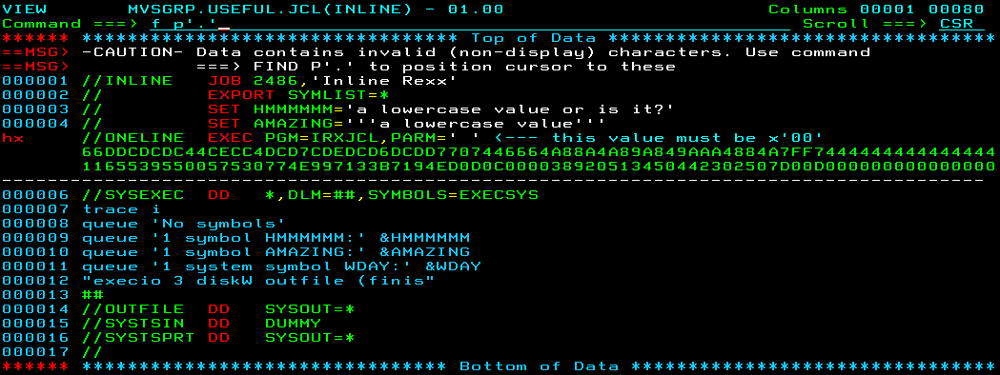

# A backup for JCL and loads #

## FTPTRACE ##

Very useful when you can't figure out why FTPS isn't working.  Credit: Wendell Lovewell.

## INLINE ##

A demonstration of how to run a Rexx in a single step in JCL.  I wish I had known this trick years ago!

## PDS2TARZ ##

A colleague requested a method of downloading all members of several PDSes.  This job creates a compressed tarball of each library,
in readiness for some kind of download, e.g. FTP, but doesn't actually perform any file transfer.

## PVRC ##

A small program which I wrote in assembler as an exercise.  It will end with a return code of whatever parameter is passed to it.

## ZIP ##

An implementation of InfoZip.  There's also an unzip.   Invoke with -h for help, or -h2 for more help.
